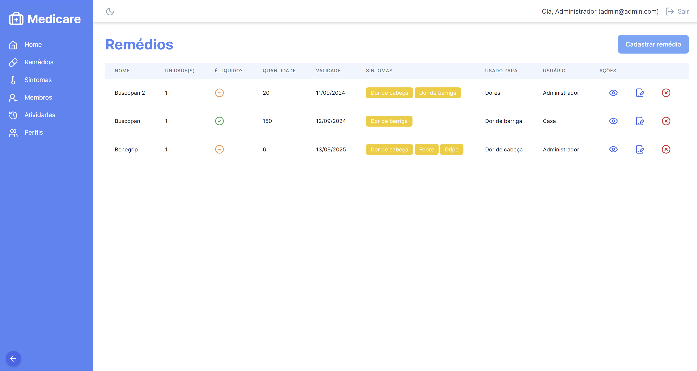

<p align="center">
  <a href="#-technologies">Technologies</a>&nbsp;&nbsp;&nbsp;|&nbsp;&nbsp;&nbsp;
  <a href="#-getting-started">Getting started</a>&nbsp;&nbsp;&nbsp;|&nbsp;&nbsp;&nbsp;
  <a href="#-project">Project</a>&nbsp;&nbsp;&nbsp;|&nbsp;&nbsp;&nbsp;
  <a href="#-layout">Layout</a>&nbsp;&nbsp;&nbsp;|&nbsp;&nbsp;&nbsp;
  <a href="#-next-steps">Next steps</a>
</p>

<h1 align="center">
  <a href="#" target="_blank">
    MEDICARE
  </a>
</h1>

---

## 🧪 Technologies and Gems

This project was developed using the following technologies and Gems:

- [Ruby 3.3.0](https://ruby-lang.org/)
- [Rails 7.1.3](https://rubyonrails.org/)
- [Postgres](https://postgresql.org/)
- [Tailwind](https://tailwindcss.com/)
- [Stimulus](https://stimulus.hotwired.dev)
- [Rails Toastify](https://github.com/eltonsantos/rails_toastify)
- [Devise](https://github.com/heartcombo/devise)
- [Kaminari](https://github.com/kaminari/kaminari)
- [Lucide Icons](https://lucide.dev/)
- [Paper Trail](https://github.com/paper-trail-gem/paper_trail)
- [Bullet](https://github.com/flyerhzm/bullet)

## 🚀 Getting started

Clone the project and access the folder

```bash
$ git clone https://github.com/eltonsantos/medicare.git && cd medicare
```

Follow the steps below

```bash
# Install the dependencies
$ bundle install

# Create database
$ rails db:create

# Run migrations
$ rails db:migrate

# Run seed
$ rails db:seed

# Start the project
$ bin/dev
```

## 💻 Project

Medicare is a system designed to meet a personal need to have a "personal pharmacy" at home and be able to manage your medications and their use.

## 🔖 Layout

<p align="center">
  
</p>

## 🐾 Next steps

###### Escreverei essa parte em português

- [ ] Cobrir o sistema de testes! 👁‍🗨
- [ ] Criação da página de estatísticas 🔎
- [ ] Layout responsivo 1️⃣
- [ ] E muito mais... ❤💪🏼

---

## 👨🏻‍💻 Author

<h3 align="center">
  
  <br/>
  <strong>Elton Santos</strong> 🚀
  <br/>
  <br/>

 <a href="https://www.linkedin.com/in/eltonmelosantos" alt="LinkedIn" target="blank">
    
  </a>

  <a href="mailto:elton.melo.santos@gmail.com?subject=Olá%20Elton" alt="Email" target="blank">
    
  </a>

<br/>

Made with ❤️ by Elton Santos 👋🏽 [Contact me!](https://www.linkedin.com/in/eltonmelosantos/)

</h3>